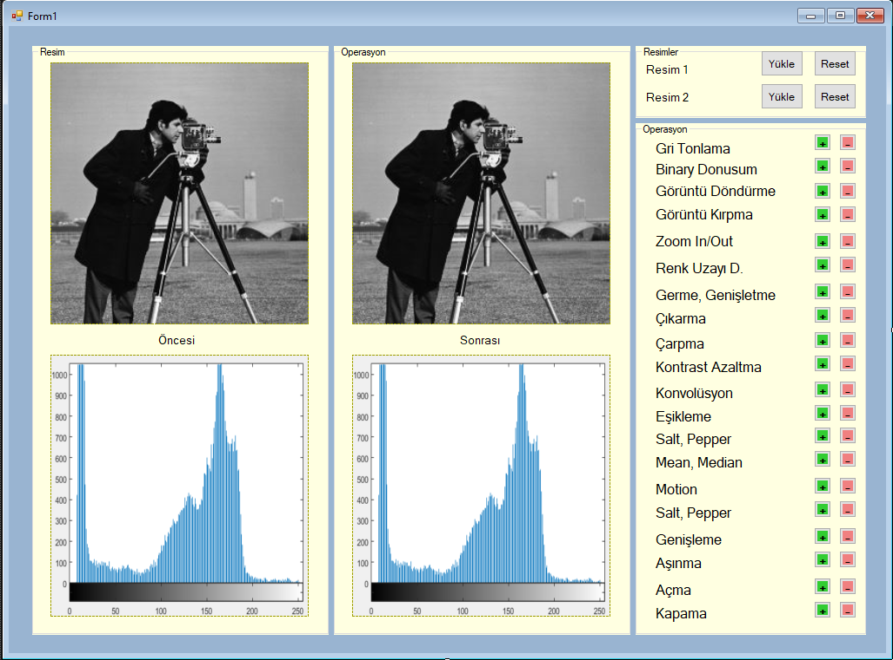

# ImageProcessing
# Gereksinimler
- [x] Gri Dönüşüm
- [ ] Binary Dönüşüm
- [ ] Görüntü Döndürme
- [ ] Görüntü Kırpma
- [ ] Görüntü Yaklaştırma/Uzaklaştırma
- [ ] Renk Uzayı Dönüşümleri
- [ ] Giriş görüntüsüne ait histogram ve orjinal görüntü histogramını germe/genişletme
- [ ] İki resim arasında aritmetik işlemler (çıkarma, çarpma)
- [ ] Kontrast azaltma
- [ ] Konvolüsyon İşlemi (median)
- [ ] Eşikleme işlemleri (Çift Eşikleme)
- [ ] Kenar Bulma Algoritmalarının Kullanımı (canny)
- [ ] Görüntüye Gürültü Ekleme (Salt&Pepper) ve filtrelerin kullanımı (mean, median) ile gürültü temizleme
- [ ] Görüntüye Filtre Uygulanması (Motion)
- [ ] Morfolojik İşlemler (Genişleme, Aşınma, Açma, Kapama)

# Arayüz
Geçici olarak tasarladığımız arayüz şu şekilde olacaktır.

Gereksinimler için kontroller sağlanmış olup, operasyon öncesi ve sonrası değişiklikler histogram vasıtasıyla görülebilecektir.
İleri bir tarihte fonksiyonların gereklilikleri için kontroller genişletilecektir.