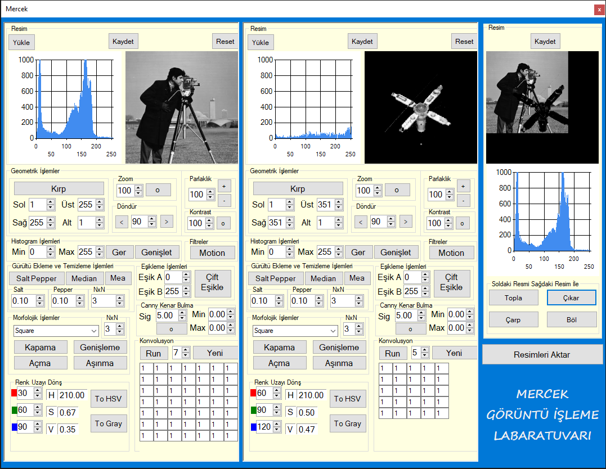

# Mercek Görüntü İşleme Kütüphanesi
Kütüphanemizi sıfırdan hazırladık, matrix operasyonlarıda dahil olmak üzere tüm görüntü işleme operasyonları itina ile hazırlandı.
## Uygulamanın Yetenekleri
- Resim yükleme
- Histogram penceresi
- Düzenlenen resimleri kaydetme
- Özel boyutlu konvolüsyon matrisi
- Özel resim çalışma alanı
- Özel çoklu resim çalışma alanı
  
## Desteklenen Operasyonlar
- [x] Gri Dönüşüm
- [x] Binary Dönüşüm
- [x] Görüntü Döndürme
- [x] Görüntü Kırpma
- [x] Görüntü Yaklaştırma/Uzaklaştırma
- [x] Renk Uzayı Dönüşümleri
- [x] Giriş görüntüsüne ait histogram ve orjinal görüntü histogramını germe/genişletme
- [x] İki resim arasında aritmetik işlemler (çıkarma, çarpma, toplama, bölme)
- [x] Kontrast azaltma
- [x] Konvolüsyon İşlemi (median)
- [x] Eşikleme işlemleri (Çift Eşikleme)
- [x] Kenar Bulma Algoritmalarının Kullanımı (canny)
- [x] Görüntüye Gürültü Ekleme (Salt&Pepper)
- [x] Filtrelerin kullanımı (mean, median, gauss) ile gürültü temizleme
- [x] Görüntüye Filtre Uygulanması (Motion)
- [x] Morfolojik İşlemler (Genişleme, Aşınma, Açma, Kapama)

## Arayüz

### Taslak arayüzümüz böyleydi

Gereksinimler için kontroller sağlanmış olup, operasyon öncesi ve sonrası değişiklikler histogram vasıtasıyla görülebilecektir.
